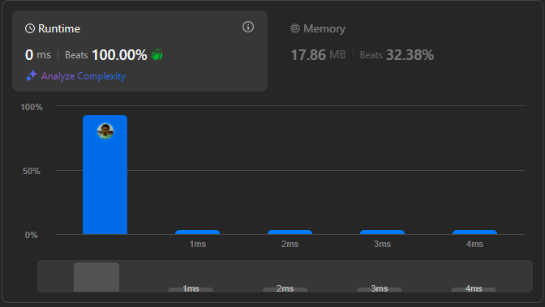

# Result

> Accepted
>
> **Runtime**: 0ms(100%)
>
> **Memory**: 17.86MB(32.38%)

**Complexity:**

- **Time:** *O(log(n))*
- **Space:** *O(log(n))*

---

[Solution](https://leetcode.com/problems/maximum-69-number/solutions/484292/java-python-replace-once)