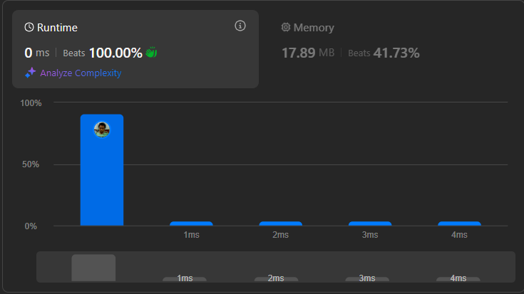

# Result

> Accepted
>
> **Runtime**: 0ms(100%)
>
> **Memory**: 17.89MB(41.73%)

**Complexity:**

- **Time:** *O(2n)*
- **Space:** *O(2n)*

---

[Solution](https://leetcode.com/problems/word-break-ii/solutions/5203877/2-approaches-extremeeeee-step-by-step-explanation/)