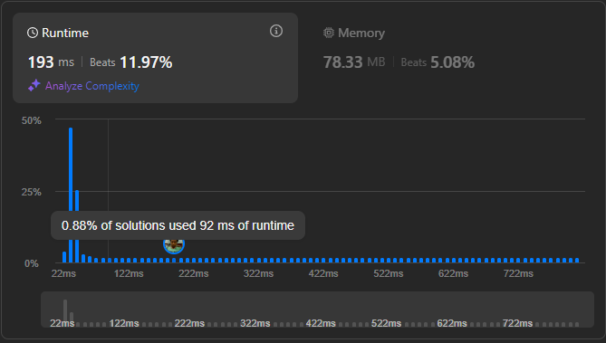

# Result

> Accepted
>
> **Runtime**: 26ms(98.41%)
>
> **Memory**: 71.99MB(72.39%)

### Old Image

### With Minor Improvements (Refer [Learnings](#learnings))

**Complexity:**

- **Time:** *O(n2)*
- **Space:** *O(n)*

---

[Solution](https://leetcode.com/problems/3sum/solutions/3523898/beats-99-48-44-145-top-interview-question/)

--

## Learnings

- There is a probably a more efficient way to solve this using 2 maps (Negative and Positive) and checking for each possible type of triplet `(-n,0,n)`, `(0,0,0)`, `(-n1, -n2, n1+n2)`, `(-(n1+n2), n1, n2)`, using `O(1)` for lookups

> **Javascript**
> - Big time gains in this method of 2 pointers also, just by using triple equals (`===`) vs double equals (`==`)
> - Another big gain was to stop the loop after i becomes positive, because we are operating on a sorted array
> - Most importantly, using `Array.push` instead `Array.concat` for the triplet list gave the largest gain in time