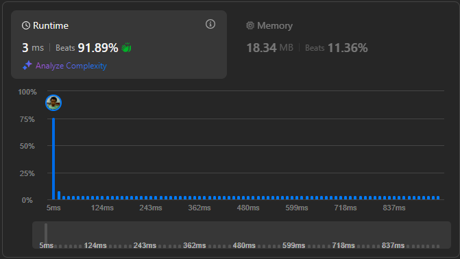

# Result

> Accepted
>
> **Runtime**: 3ms(91.89%)
>
> **Memory**: 18.34MB(11.36%)

**Complexity:**

- **Time:** *O(nlogn)*
- **Space:** *O(1)*

---

[Solution](https://leetcode.com/problems/maximum-units-on-a-truck/solutions/999125/java-python-3-sort-by-the-units-then-apply-greedy-algorithm/)