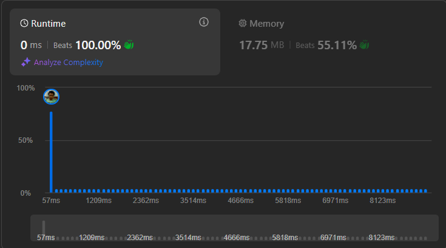

# Result

> Accepted
>
> **Runtime**: 0ms(100%)
>
> **Memory**: 17.75MB(55.11%)

**Complexity:**

- **Time:** *O(n)*
- **Space:** *O(n)*

---

[Solution](https://leetcode.com/problems/factorial-trailing-zeroes/solutions/6624303/conquer-the-trailing-zeros-trick-to-decode-factorials-like-a-pro/)