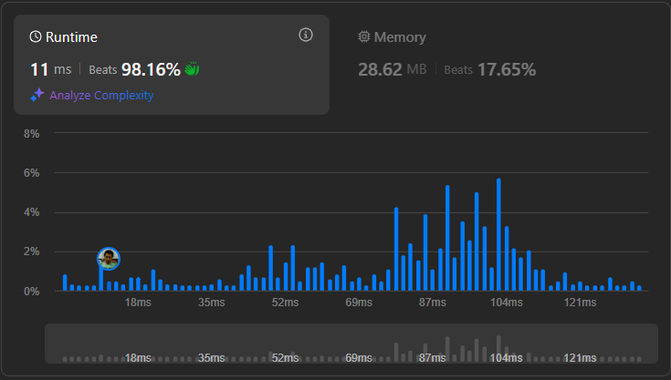

# Result

> Accepted
>
> **Runtime**: 11ms(98.16%)
>
> **Memory**: 28.62MB(17.65%)

**Complexity:**

- **Time:** *O(n)*
- **Space:** *O(1)*

---

[Solution](https://leetcode.com/problems/maximum-absolute-sum-of-any-subarray/solutions/6470501/beats-super-easy-beginners-java-c-c-python-javascript-dart)

# Learnings

- Need to understand how to use kadanes algorithm here
- Need to understand the math behind the prefix sum method