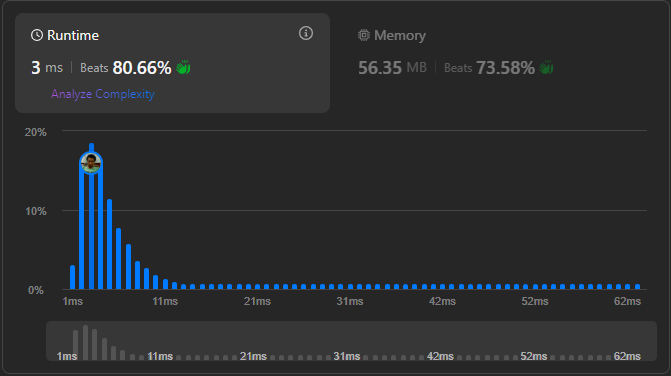

# Result

> Accepted
>
> **Runtime**: 3ms(80.66%)
>
> **Memory**: 51.35MB(73.58%)

**Complexity:**

- **Time:** *O(max(m,n)*
- **Space:** *O(1)*

---

[Solution](https://leetcode.com/problems/add-two-numbers/solutions/127833/add-two-numbers/)