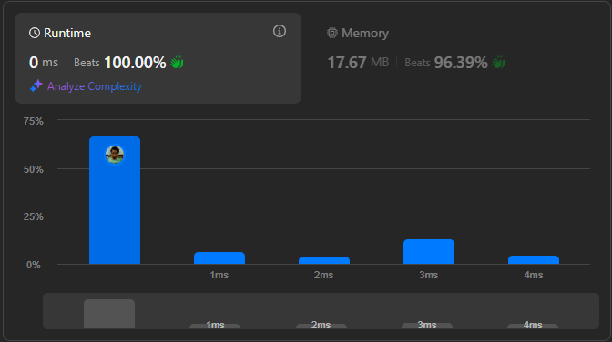

# Result

> Accepted
>
> **Runtime**: 0ms(100%)
>
> **Memory**: 17.67MB(96.39%)

**Complexity:**

- **Time:** *O(n)*
- **Space:** *O(n)*

---

[Solution](https://leetcode.com/problems/valid-parentheses/solutions/6750821/video-2-ways-to-solve-this-question/)