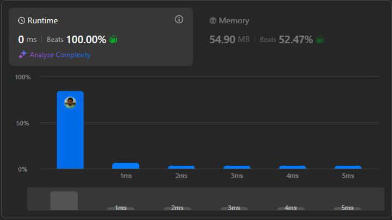

# Result

> Accepted
>
> **Runtime**: 0ms(100%)
>
> **Memory**: 54.9MB(52.47%)

**Complexity:**

- **Time:** *O((log n)2)*
- **Space:** *O(log n)*

---

[Solution](https://leetcode.com/problems/happy-number/solutions/3236759/best-c-2-solution-floyd-s-cycle-finding-algorithm-hash-table-one-stop-solution/)