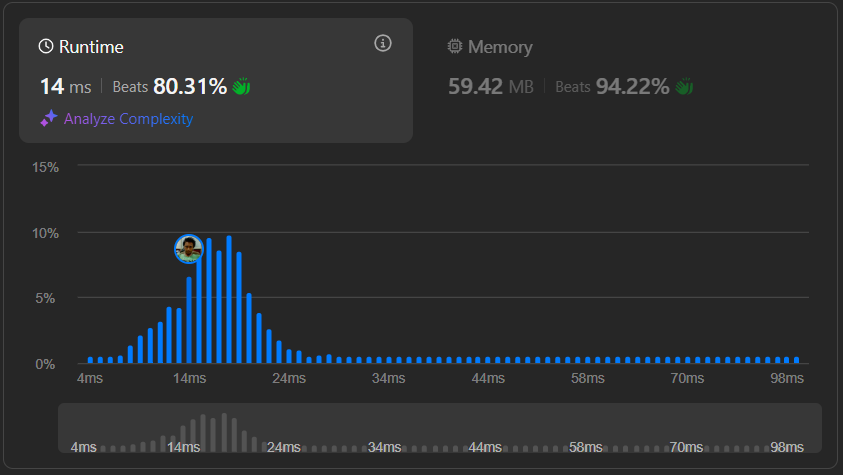

# Result

> Accepted
>
> **Runtime**: 14ms(80.31%)
>
> **Memory**: 59.42MB(94.22%)

**Complexity:**

- **Time:** *O(n)*
- **Space:** *O(1)*

---

[Solution](https://leetcode.com/problems/check-if-a-parentheses-string-can-be-valid/solutions/6267163/beats-100-3-unique-approaches-to-check-if-a-string-parantheses-can-be-valid-concise-code)