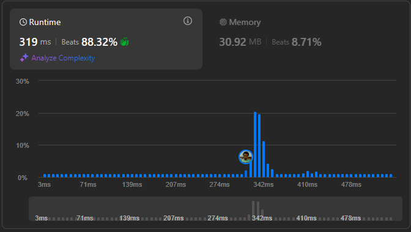

# Result

> Accepted
>
> **Runtime**: 33ms(88.32%)
>
> **Memory**: 30.92MB(8.71%)

**Complexity:**

- **Time:** *O(nlog(m))* *where n is length of the candies array and m is the size of the largest candy pile*
- **Space:** *O(1)*

---

[Solution](https://leetcode.com/problems/maximum-candies-allocated-to-k-children/solutions/6534126/binary-search-python-c-java-js-go-c-swift)