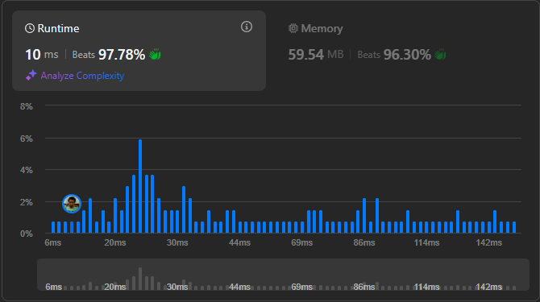

# Result

> Accepted
>
> **Runtime**: 10ms(97.78%)
>
> **Memory**: 59.54MB(96.3%)

**Complexity:**

- **Time:** *O(n)*
- **Space:** *O(1)*

---

[Solution](https://leetcode.com/problems/move-pieces-to-obtain-a-string/solutions/6114504/100-beats-short-simple/?envType=problem-list-v2&envId=251dbj67)