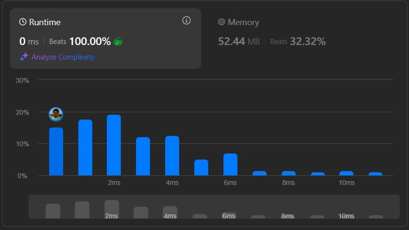

# Result

> Accepted
>
> **Runtime**: 0ms(100%)
>
> **Memory**: 52.44MB(32.32%)

**Complexity:**

- **Time:** *O(n)*
- **Space:** *O(1)*

---

[Top Solution](https://leetcode.com/problems/apply-operations-to-an-array/solutions/6065281/python-beats-100-two-pointers)