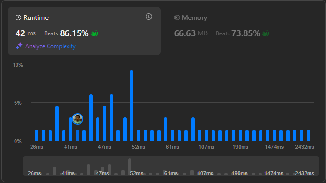

# Result

> Accepted
>
> **Runtime**: 42ms(86.15%)
>
> **Memory**: 66.63MB(73.85%)

**Complexity:**

- **Time:** *O(n)*
- **Space:** *O(n)*

---

[Solution](https://leetcode.com/problems/maximum-number-of-integers-to-choose-from-a-range-i/solutions/6117744/use-bitset-to-mark-x-in-banned-vs-sort-math-beats-100/)