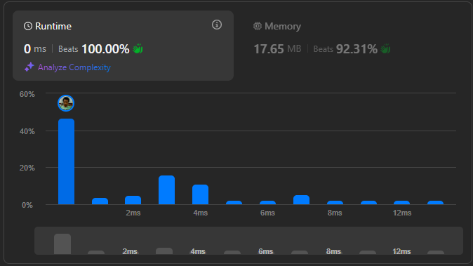

# Result

> Accepted
>
> **Runtime**: 0ms(100%)
>
> **Memory**: 17.65MB(92.31%)

**Complexity:**

- **Time:** *O(min(money, children))*
- **Space:** *O(1)*

---

[Solution](https://leetcode.com/problems/distribute-money-to-maximum-children/solutions/6817085/c-clear-and-efficient-solution-beats-100)