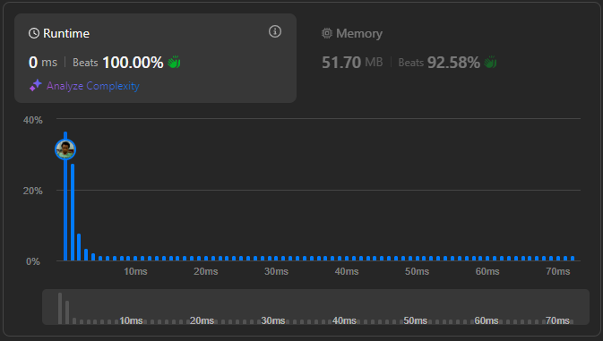

# Result

> Accepted
>
> **Runtime**: 0ms(100%)
>
> **Memory**: 51.7MB(92.58%)

**Complexity:**

- **Time:** *O(n)*
- **Space:** *O(1)*

---

[Top Solution](https://leetcode.com/problems/remove-duplicates-from-sorted-array/solutions/6284766/best-solution-ever-python-java-c-c-javascript-go-c-kotlin-typescript-swift)