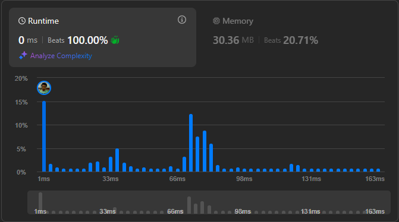

# Result

> Accepted
>
> **Runtime**: 0ms(64.14%)
>
> **Memory**: 29.67MB(73.99%)

**Complexity:**

- **Time:** *O(n*$\sqrt{m}$*)* *where m is the largest number in the matrix*
- **Space:** *O(n)*

---

[Solution](https://leetcode.com/problems/prime-in-diagonal/solutions/3395778/explained-simple-and-clear-python-code/)

## Learnings

- The Prime check is the expensive one and we should check the least amount of numbers for prime, only start checking from the largest numbers in the diagonal. Sorting once is cheaper.