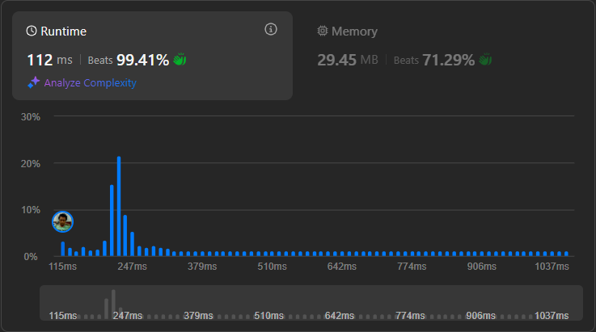

# Result

> Accepted
>
> **Runtime**: 112ms(99.41%)
>
> **Memory**: 29.45MB(71.29%)

**Complexity:**

- **Time:** *O(nlogn)*
- **Space:** *O(nlogn)*

---

[Solution](https://leetcode.com/problems/maximum-beauty-of-an-array-after-applying-operation/solutions/3771308/java-c-python-sliding-window/)
