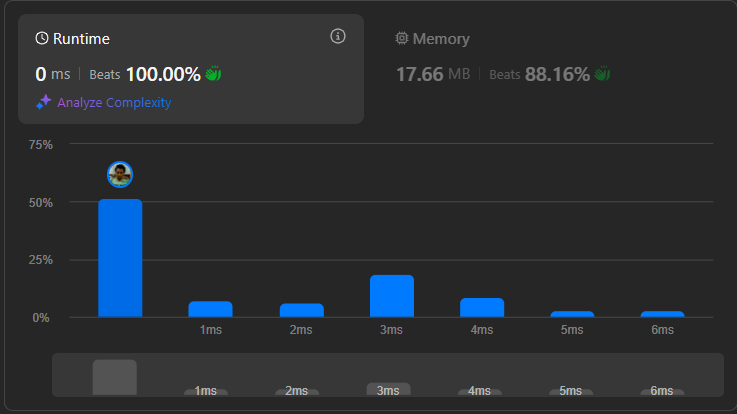

# Result

> Accepted
>
> **Runtime**: 0ms(100%)
>
> **Memory**: 17.66MB(88.16%)

**Complexity:**

- **Time:** *O(n)*
- **Space:** *O(1)*

---

[Solution](https://leetcode.com/problems/maximum-odd-binary-number/solutions/4802356/c-2-line-vs-python-1-line-vs-c-2-pointers-in-place-0ms-beats-100/)