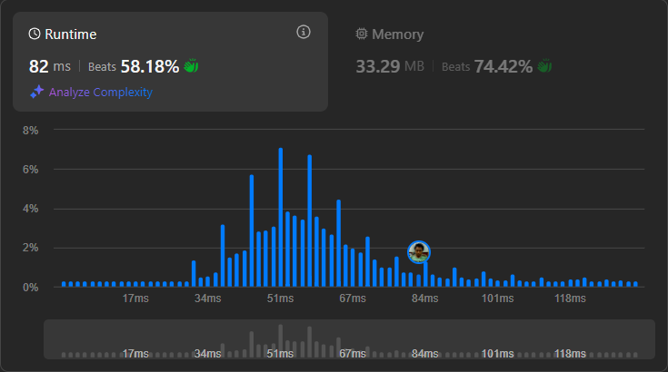

# Result

> Accepted
>
> **Runtime**: 82ms(58.18%)
>
> **Memory**: 33.29MB(74.42%)

**Complexity:**

- **Time:** *O(nlog(n))*
- **Space:** *O(1)*

---

[Solution](https://leetcode.com/problems/divide-array-into-arrays-with-max-difference/solutions/6855832/very-very-easy-with-a-little-bit-comedic-example-scenario-additional-diagram-illustration/)
