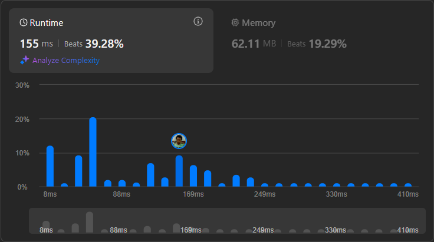

# Result

> Accepted
>
> **Runtime**: 155ms(39.28%)
>
> **Memory**: 62.11MB(19.29%)

**Complexity:**

- **Time:** *O(n2n)*
- **Space:** *O(n2n)*

---

[Top Solution](https://leetcode.com/problems/remove-invalid-parentheses/solutions/75038/evolve-from-intuitive-solution-to-optimal-a-review-of-all-solutions)

## Learnings

- Need to test BFS, DFS and DP for this kind of question. Even though all have same complexity, they will perform differently based on the execution

