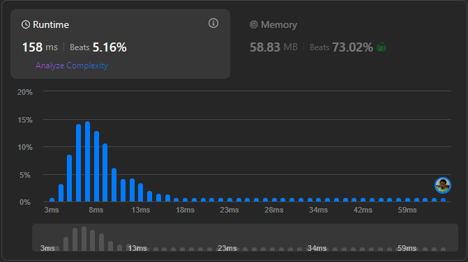

# Result

> Accepted
>
> **Runtime**: 158ms(5.16%)
>
> **Memory**: 58.83MB(73.02%)

---

[Top Solution](https://leetcode.com/problems/power-of-three/solutions/6053168/0-ms-runtime-beats-100-user-confirm-step-by-steps-solution-beginner-friendly)

