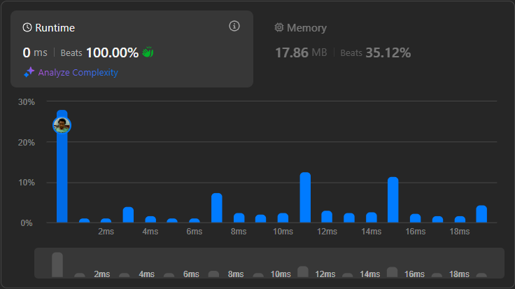

# Result

> Accepted
>
> **Runtime**: 0ms(100%)
>
> **Memory**: 17.86MB(35.12%)

**Complexity:**

- **Time:** *O(1)*
- **Space:** *O(1)*

---

[Solution](https://leetcode.com/problems/find-the-k-th-character-in-string-game-i/solutions/6912907/simple-explanation-for-why-o-1-1-liner-solution-works/)

--

## Learnings

- The string length doubled on every operation so after k operations, 2k. Whenever you see a 2x, its important to think about using binary