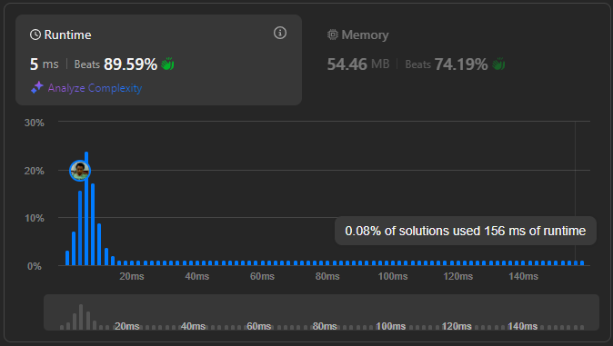

# Result

> Accepted
>
> **Runtime**: 5ms(89.59%)
>
> **Memory**: 54.46MB(74.19%)

**Complexity:**

- **Time:** *O(n)*
- **Space:** *O(n)*

---

[Top Solution](https://leetcode.com/problems/reverse-vowels-of-a-string/solutions/3723102/easy-solution-with-simple-explanation-using-two-pointer/)