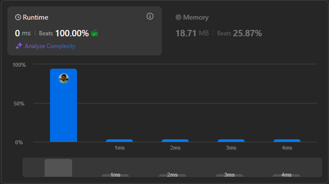

# Result

> Accepted
>
> **Runtime**: 0ms(100%)
>
> **Memory**: 18.71MB(25.87%)

**Complexity:**

- **Time:** *O(log n)*
- **Space:** *O(1)*

---

[Solution](https://leetcode.com/problems/search-insert-position/solutions/6825224/simple-c-python-solution-with-explanation-binary-search-0ms/)