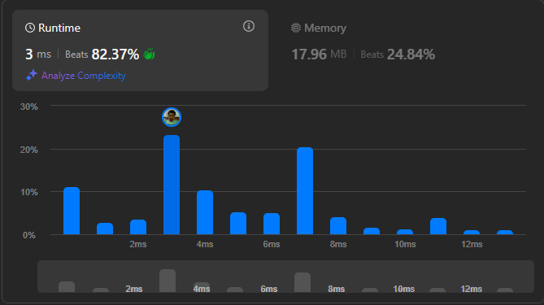

# Result

> Accepted
>
> **Runtime**: 3ms(82.37%)
>
> **Memory**: 17.96MB(24.84%)

**Complexity:**

- **Time:** *O(m * n)*
- **Space:** *O(m * n)*

---

[Solution](https://leetcode.com/problems/valid-sudoku/solutions/3277043/beats-96-78-short-7-line-python-solution-with-detailed-explanation)