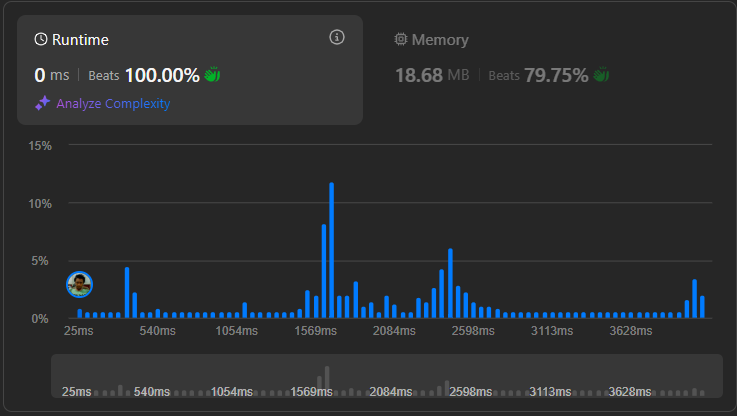

# Result

> Accepted
>
> **Runtime**: 0ms(100%)
>
> **Memory**: 18.68MB(79.75%)

**Complexity:**

- **Time:** *O((log n)3)*
- **Space:** *O((log n)2)*

---

[Solution](https://leetcode.com/problems/guess-number-higher-or-lower-ii/solutions/1356393/python-top-down-dp-bottom-up-dp-clean-concise-code-explained/)

## Learnings

- Its better to precompute the dp table for the range, when the range isn't too big