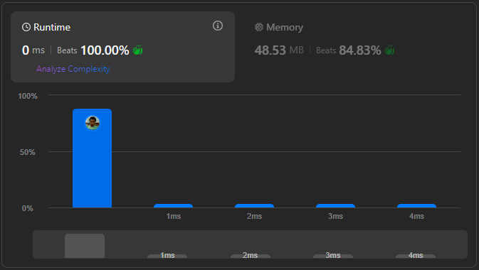

# Result

> Accepted
>
> **Runtime**: 0ms(100%)
>
> **Memory**: 48.53MB(84.83%)

**Complexity:**

- **Time:** *O(n)*
- **Space:** *O(n)*

---

[Top Solution](https://leetcode.com/problems/decode-string/solutions/6127581/0-ms-runtime-beats-100-user-code-idea-algorithm-solving-step/)