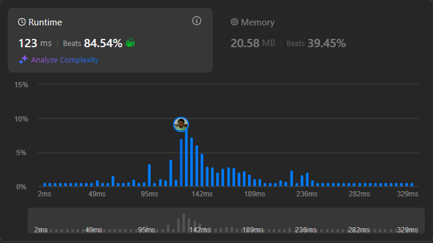

# Result

> Accepted
>
> **Runtime**: 123ms(84.54%)
>
> **Memory**: 20.58MB(39.45%)

**Complexity:**

- **Time:** O($mn \times log(mn)$)
- **Space:** *O(mn)*

---

[Solution](https://leetcode.com/problems/trapping-rain-water-ii/solutions/6641956/conquer-2d-trapping-rain-water-with-a-priority-queue-and-bfs-elevation-sweep/)