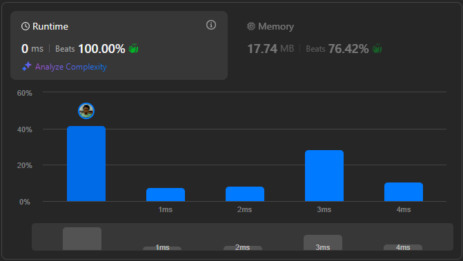

# Result

> Accepted
>
> **Runtime**: 0ms(100%)
>
> **Memory**: 17.74MB(76.42%)

**Complexity:**

- **Time:** *O(n)*
- **Space:** *O(n)*

---

[Solution](https://leetcode.com/problems/longest-palindrome/solutions/6642768/unlock-palindrome-frequency-tricks-to-build-the-longest-one-possible/)