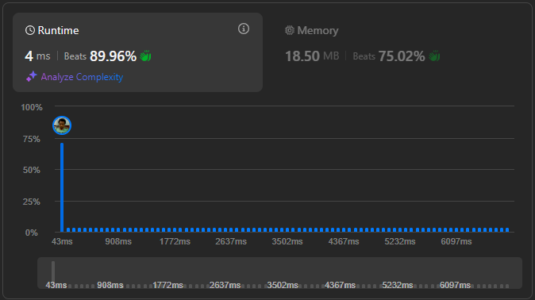

# Result

> Accepted
>
> **Runtime**: 4ms(89.98%)
>
> **Memory**: 18.5MB(75.02%)

**Complexity:**

- **Time:** *O(n)*
- **Space:** *O(1)*

---

[Solution](https://leetcode.com/problems/jump-game-ii/solutions/6840249/greedy-bfs-simulation-for-minimum-jumps/?envType=problem-list-v2&envId=251dbj67)