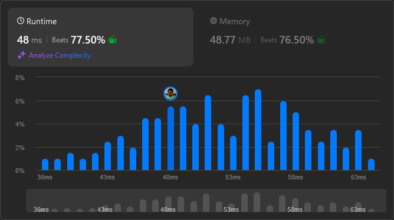

# Result

> Accepted
>
> **Runtime**: 48ms(77.5%)
>
> **Memory**: 48.77MB(76.5%)

**Complexity:**

- **Time:** *O(1)*
- **Space:** *O(1)*

---

[Top Solution](https://leetcode.com/problems/number-complement/solutions/5671548/100-0-easy-solution-with-explanation/)