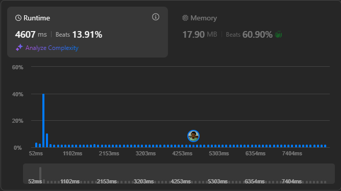

# Result

> Accepted
>
> **Runtime**: 4607ms(13.91%)
>
> **Memory**: 17.9MB(60.9%)

**Complexity:**

- **Time:** *O(n3)*
- **Space:** *O(n)*

---

[Solution](https://leetcode.com/problems/counting-bits/solutions/1808435/python-javascript-very-deep-explanation)