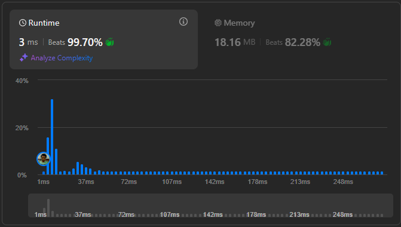

# Result

> Accepted
>
> **Runtime**: 8ms(68.48%)
>
> **Memory**: 18.26MB(5.32%)

**Complexity:**

- **Time:** *O(n!)*
- **Space:** *O(n2)*

---

[Solution](https://leetcode.com/problems/n-queens-ii/solutions/2111857/java-c-n-queens-1-2-almost-same-solution/)