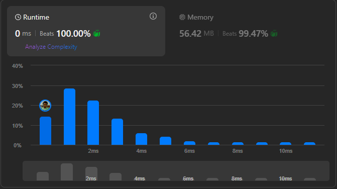

# Result

> Accepted
>
> **Runtime**: 0ms(100%)
>
> **Memory**: 51.42MB(99.47%)

**Complexity:**

- **Time:** *O(n)*
- **Space:** *O(1)*

---

[Top Solution](https://leetcode.com/problems/maximum-subarray/solutions/1595195/c-python-7-simple-solutions-w-explanation-brute-force-dp-kadane-divide-conquer)