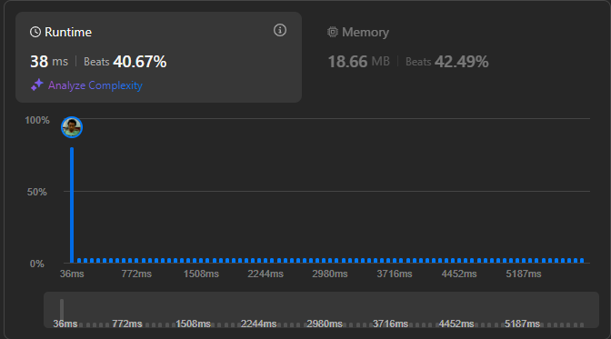

# Result

> Accepted
>
> **Runtime**: 38ms(40.67%)
>
> **Memory**: 18.66MB(42.49%)

**Complexity:**

- **Time:** *O(n)*
- **Space:** *O(1)*

---

[Solution](https://leetcode.com/problems/jump-game/solutions/3758301/java-easy-solution-with-explanation/)