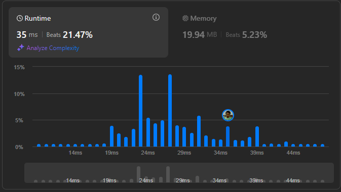

# Result

> Accepted
>
> **Runtime**: 35ms(21.47%)
>
> **Memory**: 19.94MB(5.23%)

**Complexity:**

- **Time:** *O(nlogn)*
- **Space:** *O(n)*

---

[Solution](https://leetcode.com/problems/array-partition/solutions/6856542/bucket-sort-brilliance-maximizing-pair-sum-without-sorting-using-py-2)