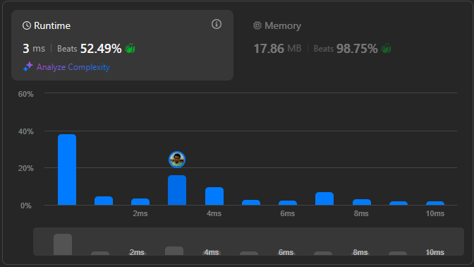

# Result

> Accepted
>
> **Runtime**: 3ms(52.49%)
>
> **Memory**: 17.86MB(98.75%)

**Complexity:**

- **Time:** *O(n)* *where `n` is number of nodes in larger tree*
- **Space:** *O(n)*

---

[Solution](https://leetcode.com/problems/merge-two-binary-trees/solutions/588123/100-00-fast-in-run-time-and-memory-recursive-iterative-bfs-dfs/)