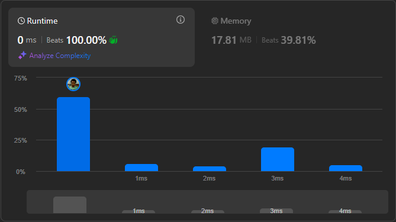

# Result

> Accepted
>
> **Runtime**: 0ms(100%)
>
> **Memory**: 17.81MB(39.81%)

**Complexity:**

- **Time:** *O(n)* *where n is length of the string*
- **Space:** *O(1)*

---

[Solution](https://leetcode.com/problems/valid-number/solutions/6356788/best-solution-for-arrays-string-in-c-python-and-java-100-working/)