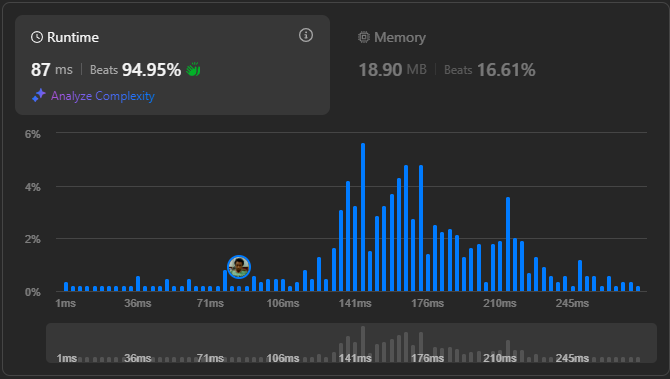

# Result

> Accepted
>
> **Runtime**: 87ms(94.95%)
>
> **Memory**: 18.9MB(16.61%)

**Complexity:**

- **Time:** *O(m * n)*
- **Space:** *O(m * n)*

---

[Solution](https://leetcode.com/problems/image-smoother/solutions/4423089/beats-98-15-in-easy-ways-4-method-explained-c-solution-with-time-and-space-complexity/)