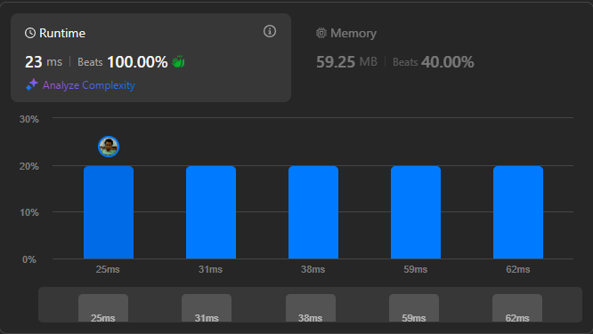

# Result

> Accepted
>
> **Runtime**: 23ms(100%)
>
> **Memory**: 59.25MB(40%)

**Complexity:**

- **Time:** *O(n3)*
- **Space:** *O(n2)*

---

[Solution](https://leetcode.com/problems/strange-printer/solutions/6875908/strange-printer-by-dynamic-programming-dp-with-bottom-up-tabulation/)