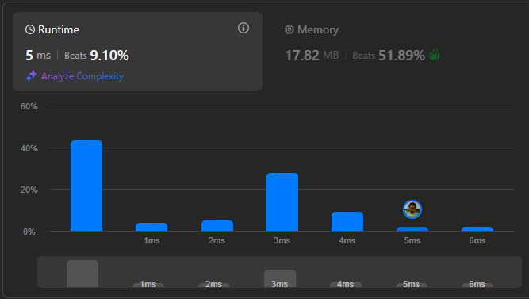

# Result

> Accepted
>
> **Runtime**: 5ms(9.1%)
>
> **Memory**: 17.82MB(51.89%)

**Complexity:**

- **Time:** *O(n)*
- **Space:** *O(n)*

---

[Solution](https://leetcode.com/problems/add-binary/solutions/3183205/1ms-beats-100-full-explanation-append-reverse-c-java-python3/)