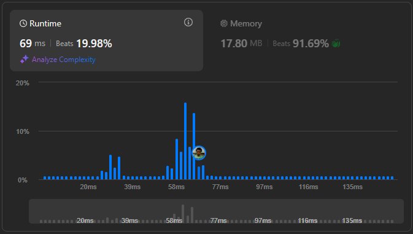

# Result

> Accepted
>
> **Runtime**: 69ms(19.98%)
>
> **Memory**: 17.8MB(91.69%)

**Complexity:**

- **Time:** *O(n)*
- **Space:** *O(n)*

---

[Solution](https://leetcode.com/problems/valid-palindrome-ii/solutions/6734798/master-one-deletion-check-to-validate-near-palindromes/)