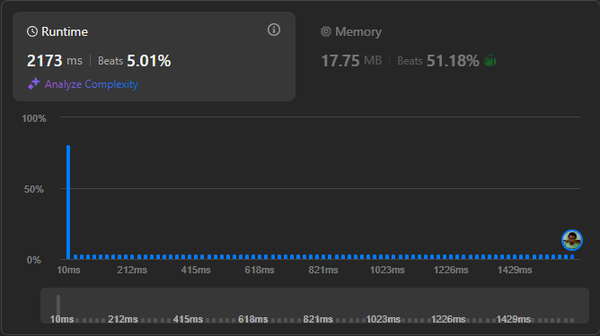

# Result

> Accepted
>
> **Runtime**: 2173ms(5.01%)
>
> **Memory**: 17.75MB(51.18%)

**Complexity:**

- **Time:** *O(log n)*
- **Space:** *O(1)*

---

[Solution](https://leetcode.com/problems/sqrtx/solutions/3706594/easy-explained-solution-beats-100/)