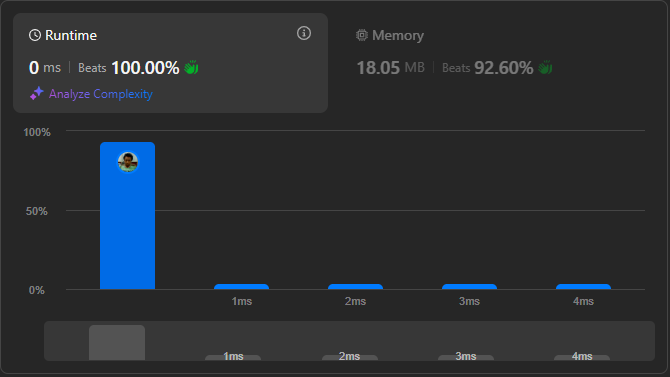

# Result

> Accepted
>
> **Runtime**: 0ms(100%)
>
> **Memory**: 18.05MB(92.6%)

**Complexity:**

- **Time:** *O(m * n)*
- **Space:** *O(1)*

---

[Solution](https://leetcode.com/problems/search-a-2d-matrix/solutions/1895837/c-binary-search-tree-explained-with-img/)