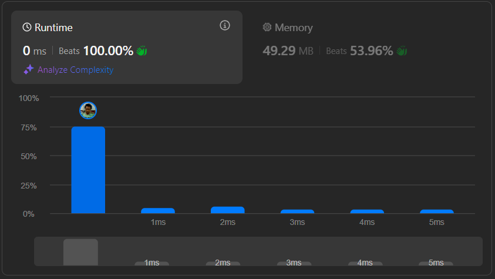

# Result

> Accepted
>
> **Runtime**: 0ms(100%)
>
> **Memory**: 42.29MB(53.96%)

**Complexity:**

- **Time:** *O(n)*
- **Space:** *O(1)*

---

[Top Solution](https://leetcode.com/problems/sort-colors/solutions/5580767/video-2-solutions-with-frequency-or-3-pointers)