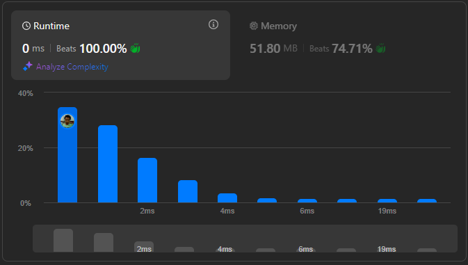

# Result

> Accepted
>
> **Runtime**: 0ms(100%)
>
> **Memory**: 51.8MB(74.71%)

**Complexity:**

- **Time:** *O(m * n)*
- **Space:** *O(1)*

---

[Top Solution](https://leetcode.com/problems/flipping-an-image/solutions/148272/easy-understand-one-pass-java-solution-absolutely-beat-100)