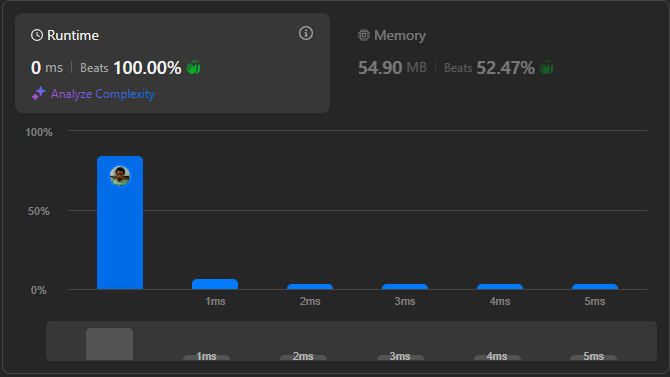

# Result

> Accepted
>
> **Runtime**: 0ms(100%)
>
> **Memory**: 54.90MB(52.47%)

**Complexity:**

- **Time:** *O((m + n)log(m + n))*
- **Space:** *O(1)*

---

[Solution](https://leetcode.com/problems/merge-sorted-array/solutions/3436053/beats-100-best-c-java-python-and-javascript-solution-two-pointer-stl/)