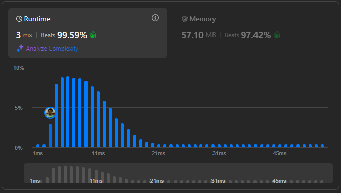

# Result

> Accepted
>
> **Runtime**: 3ms(99.59%)
>
> **Memory**: 57.1MB(97.42%)

**Complexity:**

- **Time:** *O(log10(n))*
- **Space:** *O(1)*

---

[Solution](https://leetcode.com/problems/palindrome-number/solutions/5980505/step-by-steps-solution-best-method-beats-100-user-beginner-friendly)